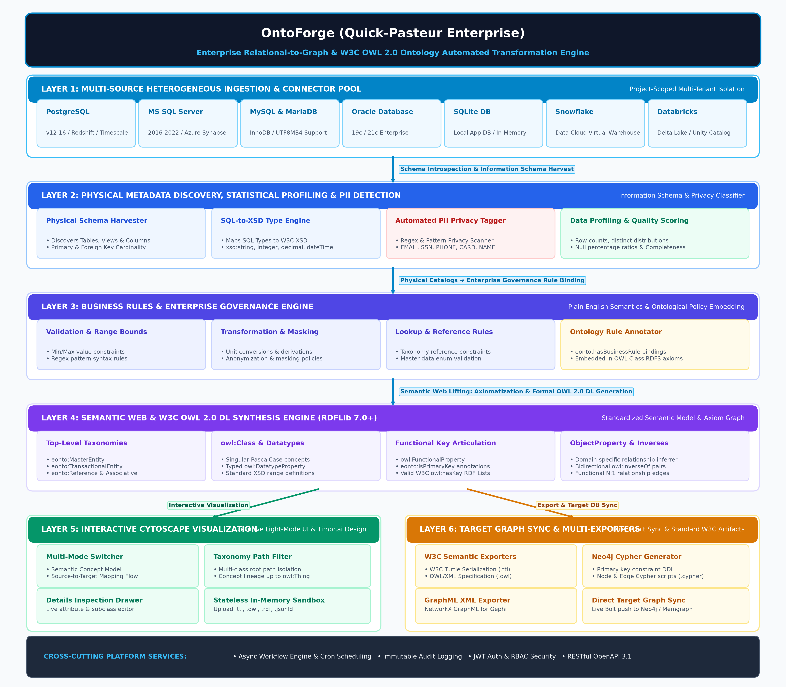

# OntoForge (Quick-Pasteur Enterprise)
> **Enterprise Relational-to-Graph & W3C OWL 2.0 Ontology Automated Transformation Engine**
> **Technical Architecture, Functional Specification & User Operating Manual**

---

## 1. Executive Summary & Strategic Overview

In enterprise data ecosystems, business information is routinely fragmented across relational database management systems (RDBMS) such as PostgreSQL, Microsoft SQL Server, Oracle, MySQL, MariaDB, and cloud lakehouses like Snowflake and Databricks. While relational architectures excel at structured transactional processing, they inherently struggle with contextual knowledge representation, semantic reasoning, cross-domain relationship discovery, and automated inference.

**OntoForge** (Quick-Pasteur Enterprise Engine) bridges this enterprise gap by providing an end-to-end automated platform that:
1. Ingests relational metadata catalogs across multiple isolated data sources.
2. Introspects schema topologies, column datatypes, primary keys, and foreign keys.
3. Profiles data distributions, detects Personally Identifiable Information (PII), and computes quality scores.
4. Harmonizes business governance rules directly into ontology axioms and annotations.
5. Synthesizes standardized **W3C OWL 2.0 DL Ontologies** (`owl:Class`, `owl:DatatypeProperty`, `owl:ObjectProperty`, `owl:inverseOf`, `owl:hasKey`).
6. Renders interactive Cytoscape graph diagrams with multi-mode visualization (Concept Ontology, Source Metadata, and Source-to-Target Lineage Mapping).
7. Exports models to **W3C Turtle (`.ttl`)**, **OWL/XML (`.owl`)**, **Neo4j Cypher (`.cypher`)**, and **GraphML (`.graphml`)**, with live target graph synchronization.
8. Provides a zero-persistence **Stateless Ontology Sandbox** for instant drag-and-drop parsing and exploration of external RDF/OWL files.

---

## 2. System Architecture & Technical Stack

### 2.1 High-Resolution Enterprise Architecture Diagram

### 2.2 Interactive Architectural Flow (Mermaid Model)

```mermaid
flowchart TD
    %% Global Styling
    classDef dbLayer fill:#F0F9FF,stroke:#0284C7,stroke-width:2px,color:#0F172A;
    classDef discLayer fill:#EFF6FF,stroke:#2563EB,stroke-width:2px,color:#0F172A;
    classDef ruleLayer fill:#EEF2FF,stroke:#4F46E5,stroke-width:2px,color:#0F172A;
    classDef owlLayer fill:#F5F3FF,stroke:#7C3AED,stroke-width:2px,color:#0F172A;
    classDef uiLayer fill:#ECFDF5,stroke:#059669,stroke-width:2px,color:#0F172A;
    classDef exportLayer fill:#FFFBEB,stroke:#D97706,stroke-width:2px,color:#0F172A;
    classDef coreEngine fill:#0F172A,stroke:#38BDF8,stroke-width:2px,color:#FFFFFF;

    subgraph L1 ["LAYER 1: MULTI-SOURCE INGESTION & CONNECTORS"]
        PG[("PostgreSQL\n(Redshift / Timescale)")]
        MS[("MS SQL Server\n(Synapse / Azure SQL)")]
        MY[("MySQL / MariaDB\n(InnoDB UTF8MB4)")]
        ORA[("Oracle DB\n(19c / 21c Enterprise)")]
        SQLITE[("SQLite DB\n(Local / In-Memory)")]
        SF[("Snowflake\n(Data Cloud Warehouse)")]
        DBR[("Databricks\n(Delta Lake / Unity)")]
    end
    class PG,MS,MY,ORA,SQLITE,SF,DBR dbLayer;

    subgraph L2 ["LAYER 2: METADATA DISCOVERY, STATISTICAL PROFILING & PII DETECTION"]
        DISC["Physical Schema Harvester\n(Tables, Views, Primary & Foreign Keys)"]
        XSD_MAP["SQL-to-XSD Type Engine\n(xsd:string, integer, decimal, dateTime)"]
        PII_SCAN["Automated PII Privacy Detector\n(EMAIL, SSN, PHONE, CARD, NAME)"]
        PROF["Data Profiler & Completeness Scorer\n(Row counts, distinct values, null ratios)"]
    end
    class DISC,XSD_MAP,PII_SCAN,PROF discLayer;

    subgraph L3 ["LAYER 3: BUSINESS RULES & ENTERPRISE GOVERNANCE ENGINE"]
        R_VAL["Validation & Bounds Rules\n(Range limits, regex patterns)"]
        R_TRANS["Transformation & Derivation\n(Unit conversions, derivations)"]
        R_LOOKUP["Reference & Master Lookups\n(Taxonomy dictionary bindings)"]
        R_MASK["Privacy Masking Policies\n(PII obfuscation & anonymization)"]
        R_BIND["Ontological Rule Compiler\n(eonto:hasBusinessRule annotations)"]
    end
    class R_VAL,R_TRANS,R_LOOKUP,R_MASK,R_BIND ruleLayer;

    subgraph L4 ["LAYER 4: SEMANTIC WEB & W3C OWL 2.0 DL SYNTHESIS ENGINE (RDFLib 7.0+)"]
        TAX["Top-Level Taxonomies\n(MasterEntity, TransactionalEntity, ReferenceEntity, AssociativeEntity)"]
        CLASSES["owl:Class & Datatype Generation\n(Singular PascalCase concepts, typed owl:DatatypeProperty)"]
        PKS["Functional Primary Key Articulation\n(owl:FunctionalProperty, eonto:isPrimaryKey, owl:hasKey lists)"]
        OBJS["Semantic Object Properties & Inverses\n(Domain-specific naming, bidirectional owl:inverseOf axioms)"]
    end
    class TAX,CLASSES,PKS,OBJS owlLayer;

    subgraph L5 ["LAYER 5: INTERACTIVE CYTOSCAPE VISUALIZATION & SANDBOX"]
        UI_MODES["Multi-Mode Canvas Switcher\n(Semantic Ontology / Source Metadata / Mapping View)"]
        UI_FILTER["Taxonomy Path Root Filter\n(Multi-class path isolation up to owl:Thing)"]
        UI_DRAWER["Details Inspection Drawer\n(Attribute editor, lineage, instant subclass creation)"]
        UI_SANDBOX["Stateless In-Memory Sandbox\n(Drag & drop .ttl, .owl, .rdf, .jsonld parser)"]
    end
    class UI_MODES,UI_FILTER,UI_DRAWER,UI_SANDBOX uiLayer;

    subgraph L6 ["LAYER 6: TARGET GRAPH SYNC & MULTI-EXPORTERS"]
        EXP_TTL["W3C Turtle (.ttl) & OWL/XML (.owl)\n(RDF 1.1 / OWL 2.0 DL Serializations)"]
        EXP_CYPHER["Neo4j Cypher DDL Scripts (.cypher)\n(Unique constraint DDL & Graph Node/Edge inserts)"]
        EXP_GML["GraphML XML Exporter (.graphml)\n(NetworkX topology for Gephi / Cytoscape)"]
        EXP_BOLT["Direct Bolt Protocol Sync\n(Live transactional sync to Neo4j / Memgraph)"]
    end
    class EXP_TTL,EXP_CYPHER,EXP_GML,EXP_BOLT exportLayer;

    %% Inter-layer Flow Connectors
    L1 -->|"Information Schema Discovery & Harvesting"| L2
    L2 -->|"Physical Catalogs & Column Profiles"| L3
    L3 -->|"Governance Rules & Target Annotations"| L4
    L4 -->|"Compiled Semantic Graph Model"| L5
    L4 -->|"W3C OWL Triples & Property Graph"| L6
```

### 2.3 Layer Decomposition & Interaction Matrix

| Layer / Subsystem | Primary Capabilities | Inputs & Predecessors | Outputs & Handoffs |
| :--- | :--- | :--- | :--- |
| **Layer 1: Multi-Source Ingestion** | PostgreSQL, MSSQL, MySQL, Oracle, SQLite, Snowflake & Databricks connection pool & health diagnostics | Raw Database Endpoints & Encrypted Credentials | Live Connection Handlers & Schemas |
| **Layer 2: Discovery & Profiling** | Information Schema discovery, SQL-to-XSD datatype mapping, automated PII detection & quality scoring | Relational Database Catalogs | Physical Metadata Catalog & Column Profiles |
| **Layer 3: Business Governance** | Plain-English governance rules engine (Validation, Masking, Transformation, Lookup, Quality) | Business Analyst & Data Steward Inputs | Rule Bindings & Target Annotations |
| **Layer 4: Semantic OWL Synthesis** | W3C OWL 2.0 DL generator, upper-taxonomies, Datatype/Object properties, owl:hasKey, owl:inverseOf | Metadata Catalog + Bound Business Rules | RDF Triples & Formal OWL 2.0 DL Ontology |
| **Layer 5: Interactive Visualizer** | Cytoscape.js canvas, Timbr design system, multi-mode view switcher, root path filter, stateless sandbox | Compiled OWL Model & External RDF Files | Interactive Concept & Mapping Diagrams |
| **Layer 6: Target Graph & Export** | W3C Turtle (.ttl), OWL/XML (.owl), Neo4j Cypher DDL (.cypher), GraphML (.graphml), direct Bolt sync | Synthesized Ontology & Property Graph | Target Knowledge Graph (Neo4j / Memgraph) |

### Technology Matrix

| Subsystem | Component / Framework | Version | Role & Responsibility |
| :--- | :--- | :--- | :--- |
| **Backend Core** | FastAPI (ASGI) | 0.115+ | High-speed asynchronous REST API, OpenAPI docs & routing |
| **ASGI Server** | Uvicorn | 0.32+ | Production ASGI server with multiprocessing & live-reload |
| **ORM & DB Engine** | SQLAlchemy | 2.0+ | Relational database mapping, connection pooling & schema sync |
| **Application DB** | SQLite / PostgreSQL | 3.x / 15+ | Stores metadata catalogs, project isolation states & rules |
| **Semantic Web** | RDFLib | 7.0+ | W3C RDF graph synthesis, OWL 2.0 DL axiomatization & serialization |
| **Graph Engine** | NetworkX | 3.4+ | Topological analysis, cycle detection & GraphML generation |
| **Validation** | Pydantic v2 | 2.10+ | Strict runtime request/response serialization & schema integrity |
| **Frontend Shell** | Vanilla HTML5 / ES6+ | ES2022+ | Single Page Application (SPA) modular UI controllers |
| **Graph Canvas** | Cytoscape.js | 3.28+ | Force-directed physics graph simulation (CoSE, Breadth-First) |
| **Target Sync** | Neo4j Bolt Driver / REST | 5.x+ | Direct live Cypher constraint & node/edge synchronization |

---

## 3. Core Functional Modules

### 3.1 Multi-Source Connectors & Target Graph Topology
- **Multi-Source Ingestion**: Map multiple distinct relational databases into an isolated project workspace.
- **Connection Diagnostics**: Instant health checks verifying reachability and credentials.
- **Target Knowledge Graph**: Configure Neo4j, Memgraph, Apache AGE, or AWS Neptune with Bolt/HTTP endpoints.

### 3.2 Automated Metadata Discovery & Profiling
- **Deep Introspection**: Catalogs tables, views, primary keys, and foreign keys.
- **SQL-to-XSD Mapping**: Converts SQL data types to standard W3C XML Schema datatypes (`xsd:string`, `xsd:integer`, `xsd:decimal`, `xsd:dateTime`, `xsd:hexBinary`).
- **PII Privacy Detection**: Automatic detection and classification of sensitive fields (`EMAIL`, `SSN`, `PHONE`, `CREDIT_CARD`, `NAME`).
- **Data Quality Scoring**: Statistical metrics on row counts, distinct values, and null ratios.

### 3.3 Business Rules & Governance Engine
- Plain-English rule formulations categorized into 7 standard governance types:
  1. **VALIDATION**: Value ranges, bounds, and pattern regex rules.
  2. **TRANSFORMATION**: Derivation, calculation, and unit conversion policies.
  3. **LOOKUP**: Reference dictionary and classification code constraints.
  4. **MASKING**: Anonymization and privacy protection specifications.
  5. **QUALITY**: Completeness, freshness, and null threshold requirements.
  6. **ENRICHMENT**: Synthetic semantic attributes and external taxonomy alignments.
  7. **CUSTOM**: Bespoke corporate compliance specifications.
- Rules are automatically compiled as `eonto:hasBusinessRule` annotations and `rdfs:comment` axioms within the synthesized ontology.

### 3.4 Semantic Web & W3C OWL 2.0 DL Ontology Engine
- **Class Taxonomies**: Generates singular PascalCase classes structured under upper-ontology concepts:
  - `eonto:MasterEntity` (subClassOf `owl:Thing`)
  - `eonto:TransactionalEntity` (subClassOf `owl:Thing`)
  - `eonto:ReferenceEntity` (subClassOf `owl:Thing`)
  - `eonto:AssociativeEntity` (subClassOf `owl:Thing`)
- **Functional Primary Keys**: Articulates primary keys using `owl:FunctionalProperty`, `eonto:isPrimaryKey`, and standard W3C OWL 2 `owl:hasKey` RDF List collections.
- **Semantic Object Properties**: Automatically infers clean active/passive names (`placedBy` / `hasOrder`, `bindsCompound` / `boundByProtein`, `billsProduct` / `billedInInvoiceItem`).
- **Bidirectional Inverse Axioms**: Generates forward/inverse property pairs linked with formal `owl:inverseOf` statements.

### 3.5 Graphical Ontology Visualizer (Timbr.ai Design System)
- **Visual Node Distinction**: Concept circles (sky-blue), superclasses (navy), datatype properties (teal squares), and object properties (emerald diamonds).
- **Triple Mode View Switcher**:
  - `Semantic Ontology`: Conceptual class and relationship hierarchy.
  - `Source Metadata`: Physical relational table architecture.
  - `Mapping View`: Interactive flow lines connecting source database columns directly to target ontology concepts.
- **Right-Side Inspection Drawer**: Deep inspection of physical lineage, scalar properties, connected relationships, and governance rules with instant subclass generation.

### 3.6 Stateless Upload & Sandbox Viewer
- **Zero-Persistence In-Memory Parsing**: Accepts multi-format files (`.ttl`, `.owl`, `.rdf`, `.xml`, `.jsonld`, `.nt`) or raw text.
- **Interactive Multi-View Workspace**:
  1. *Knowledge Graph*: Real-time Cytoscape canvas with physics layouts (CoSE, Breadth-First, Concentric, Circle, Grid).
  2. *OWL Classes*: Grid of discovered classes with inheritance and attribute counts.
  3. *Properties & Relationships*: Filterable table of scalar attributes and relationship edges.
  4. *Raw Turtle Source*: Formatted RDF syntax highlighting with one-click copy and download.

---

## 4. Step-by-Step User Operating Guide

1. **Project Creation**: Click `➕ New Project` in the header navbar to create a project workspace.
2. **Add Source Database**: Go to `🔌 Database Connectors`, click `➕ Add Source Database`, enter host/credentials, click `Test Connection`, and save.
3. **Configure Target Graph**: On the Connectors panel, click `🎯 Configure Target Graph DB` to set up your Neo4j / Memgraph endpoint.
4. **Run Discovery**: Open `🔍 Metadata Discovery` and click `⚡ Run Auto Discovery`.
5. **Inspect Profiling & PII**: Go to `📈 Data Profiling & Quality` and click `⚡ Run Data Profiling` to examine null distributions and PII tags.
6. **Formulate Business Rules**: Open `⚙️ Business Rules Engine`, click `➕ Add Business Rule`, define rule semantics, and bind to target entities.
7. **Synthesize Ontology**: Open `🧠 OWL Ontology Editor`, click `🔄 Re-Generate Ontology` to synthesize W3C OWL 2.0 DL models.
8. **Explore Visually**: Open `🌐 Graphical Ontology` to interact with the concept graph, search nodes, filter taxonomy paths, and inspect properties in the right-side drawer.
9. **Sandbox Testing**: Go to `📤 Upload & View Ontology` to drag-and-drop external RDF files for real-time in-memory visualization.
10. **Export & Target Sync**: Export `.ttl`, `.owl`, `.cypher`, or `.graphml` files, or click `🚀 Export & Sync to Target DB` to synchronize live to Neo4j.

---

## 5. REST API Summary

- **Authentication**: `POST /api/v1/auth/token`, `GET /api/v1/auth/me`
- **Projects**: `GET/POST /api/v1/projects`, `PUT/DELETE /api/v1/projects/{id}`
- **Connectors**: `GET/POST /api/v1/projects/{id}/source-connections`, `POST .../test`, `POST /api/v1/projects/{id}/graph-configs`
- **Discovery & Profiling**: `POST /api/v1/projects/{id}/metadata/discover`, `POST /api/v1/projects/{id}/profiling/run`
- **Business Rules**: `GET/POST /api/v1/projects/{id}/rules`
- **Ontology Engine**: `GET /api/v1/projects/{id}/ontology/generate`, `POST .../classes`, `PUT .../classes/{name}`, `POST .../export`
- **Stateless Sandbox**: `POST /api/v1/ontology/parse-preview`, `POST /api/v1/ontology/upload-preview`
- **Knowledge Graph**: `GET /api/v1/projects/{id}/graph/generate`, `POST .../export`, `POST .../sync-to-target`
- **Workflows & Dashboard**: `POST /api/v1/projects/{id}/workflows`, `GET /api/v1/dashboard/stats`

---

## 6. Document Artifacts

- **Word Document (.docx)**: [OntoForge_Enterprise_Documentation.docx](file:///c:/Users/TIJO/Documents/antigravity/quick-pasteur/OntoForge_Enterprise_Documentation.docx)
- **Descriptive Word Document (.docx)**: [Quick_Pasteur_Application_Architecture_and_Usage_Guide.docx](file:///c:/Users/TIJO/Documents/antigravity/quick-pasteur/Quick_Pasteur_Application_Architecture_and_Usage_Guide.docx)
- **Markdown Specification**: [docs/APPLICATION_DOCUMENTATION.md](file:///c:/Users/TIJO/Documents/antigravity/quick-pasteur/docs/APPLICATION_DOCUMENTATION.md)
